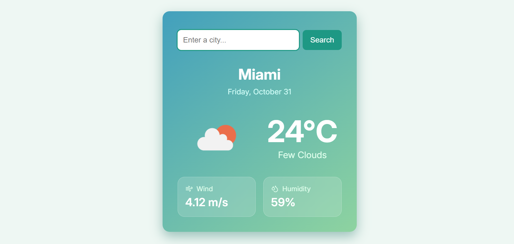

# Weather App

A simple responsive weather widget built with HTML, CSS, and vanilla JavaScript. The app uses the OpenWeatherMap API to show current weather conditions for the user's location or a searched city.



## Features

- Search current weather by city name
- Automatically requests the user's current location when geolocation is available
- Falls back to Copenhagen if location access is unavailable or denied
- Displays temperature, weather description, wind speed, humidity, and weather icon
- Handles invalid city searches with a clear empty/error state
- Static frontend with no build step required

## Project Structure

```text
.
|-- index.html
|-- script.js
|-- styles.css
|-- README.md 
`-- favicon_io/
```

## Getting Started

Because this is a static site, you can run it directly in a browser.

1. Clone or download the project.
2. Open `index.html` in your browser.
3. Allow location access if you want weather for your current location.
4. Search for any city using the input at the top of the widget.

For the best local-development experience, serve the folder with a small static server. If you have Node.js installed, you can use:

```bash
npx serve .
```

You can also use the VS Code Live Server extension and open `index.html` with Live Server.

Then open the local URL printed by your server, usually something like:

```text
http://localhost:3000
```

## API

Weather data is fetched from the OpenWeatherMap Current Weather Data API.

The API key is currently defined in `script.js`:

```js
const API_KEY = "your-api-key";
```

For a public or production project, avoid committing a real API key directly in client-side code. Use a backend proxy or environment-based configuration instead.

## Main Files

- `index.html` contains the widget markup and links the styles, favicon, fonts, and JavaScript.
- `styles.css` defines the layout, weather card styling, responsive behavior, and glass-style detail cards.
- `script.js` handles geolocation, API requests, search form behavior, error handling, and UI updates.

## Notes

- The app uses metric units, so temperatures are shown in Celsius and wind speed is shown in meters per second.
- Geolocation requires browser permission and may work more reliably when served from `localhost` instead of opened as a local file.
